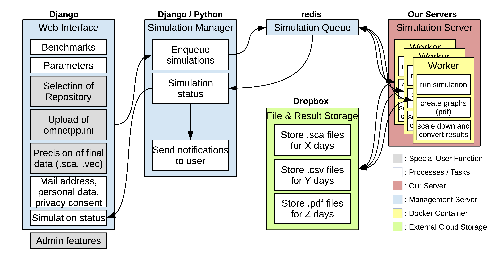

# OPS on the Bench (OOTB)

Research in Opportunistic Networks (OppNets) related to large scale evaluations depends on simulations to compare the performance of different forwarding protocols and their parameters ([1](https://www.mdpi.com/1999-5903/11/5/113)). The comparability and credibility of research are in crisis due to the variety of ways researchers perform evaluations ([2](https://dl.acm.org/doi/10.1145/1096166.1096174), [3](https://dl.acm.org/doi/10.1145/2812803), [4](https://www.acm.org/publications/policies/artifact-review-and-badging-current), [5](https://drops.dagstuhl.de/opus/frontdoor.php?source_opus=10347)). The code in this repository implements a simulation platform called **OPS on the Bench**(OOTB) to overcome these problems by enabling the use of OppNets benchmarks that foster repeatability, reproducibility and replicability of comparable, credible and scalable performance evaluations. More details about OOTB are vailable in the publication [Benchmarking data dissemination protocols for opportunistic networks](https://dl.acm.org/doi/10.1145/3458473.3458819)

The sections linked below provide all information about OOTB including installing, bringing up and using the platform.

#### Architectural Information

- Architecture of OOTB and required components - [Architecture and Prerequisites](#architecture-and-prerequisites)  

#### Installing and Using OOTB

- Installing OOTB platform - [Building and Installing](res/INSTALL.md)
- Bringing up the OOTB platform - [Bringing Up](res/START.md)
- Running simulations in OOTB (by Users) - [Running Simulations](res/RUN.md) and [User Manual](res/USERMANUAL.md)

#### Additional Information About OOTB

- Configuring cloud service to store data - [Storage Backend](res/STORE.md)
- Accessing server details - [Accessing Server Configurations](res/SERVERCONFACCESS.md)
- Accessing user profile configurations - [Accessing Profile Configurations](res/PROFILECONFACCESS.md)
- Versions of used software - [Software Versions](res/SWVERSIONS.md)

#### Contact Information

- Questions or comments about this work - [Questions or Comments](#questions-or-comments) 

##  Architecture and Prerequisites

The architecture of the OOTB platform consist of a set of sofware modules interacting to provide simulations of opportunistic networks. The picture below shows the conceptual architecture of OOTB. 

To enable OOTB, the following software components must be installed and configured.

- Django, a Python-based web framework [Django](https://www.djangoproject.com)
- Docker, an OS-level virtualization environment [Docker](https://www.docker.com)
- Redis, a distributed in-memort data store [redis](https://redis.io)
- OPS, an opportunistic networking model framework [OPS](https://github.com/ComNets-Bremen/OPS.git)
- Cloud Service, a cloud based storage service (such as Dropbox)

##  Predictions

-- To Do

## Questions or Comments

The OOTB platform is described in the publication linked [here](https://dl.acm.org/doi/10.1145/3458473.3458819). If you have further questions, comments or even suggestions, we will be very glad to hear them. Write to us using `ootb at comnets.uni-bremen.de`.
