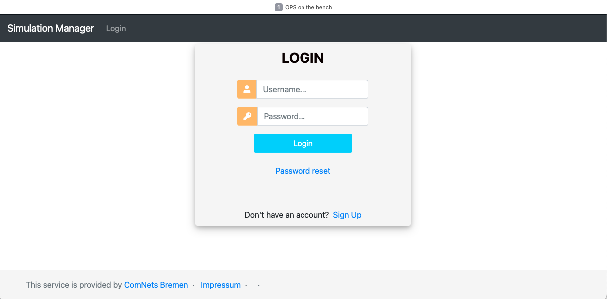
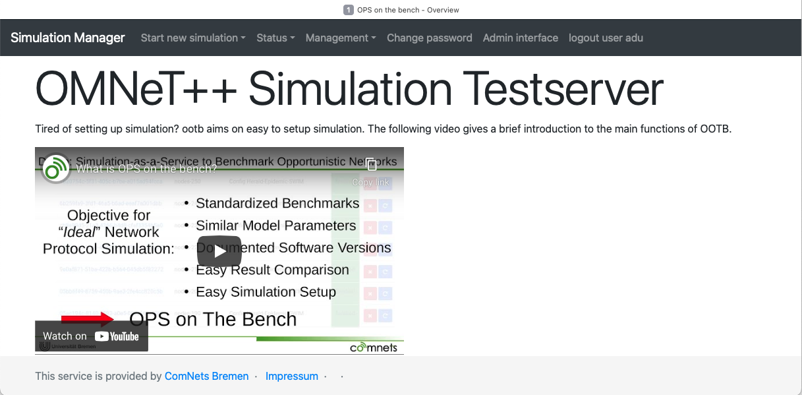

# OPS on the Bench (OOTB)


Research in Opportunistic Networks (OppNets) related to large scale evaluations depends on simulations to compare the performance of different forwarding protocols and their parameters ([1](https://www.mdpi.com/1999-5903/11/5/113)). The comparability and credibility of research are in crisis due to the variety of ways researchers perform evaluations ([2](https://dl.acm.org/doi/10.1145/1096166.1096174), [3](https://dl.acm.org/doi/10.1145/2812803), [4](https://www.acm.org/publications/policies/artifact-review-and-badging-current), [5](https://drops.dagstuhl.de/opus/frontdoor.php?source_opus=10347)). The code in this repository implements a simulation platform called **OPS on the Bench**(OOTB) to overcome these problems by enabling the use of OppNets benchmarks that foster repeatability, reproducibility and replicability of comparable, credible and scalable performance evaluations. More details about OOTB are vailable in the publication [Benchmarking data dissemination protocols for opportunistic networks](https://dl.acm.org/doi/10.1145/3458473.3458819)

The sections linked below provide all information about OOTB including installing, bringing up and using the platform.

#### Architectural Information

- Architecture of OOTB and required components - [Architecture and Prerequisites](#architecture-and-prerequisites)  

#### Installing and Using OOTB

- Installing OOTB platform - [Building and Installing](#building-and-installing)
- Bringing up the OOTB platform - [Bringing Up](#bringing-up)
- Running simulations in OOTB (by Users) - [Running Simulations](#running-simulations)

#### Additional Information About OOTB

- Configuring cloud service to store data - [Storage Backend](#storage-backend)
- Accessing server details - [Accessing Server Configurations](#accessing-server-configurations)
- Accessing user profile configurations - [Accessing Profile Configurations](#accessing-profile-configurations)
- Versions of used software - [Software Versions]()

#### Contact Information

- Questions or comments about this work - [Questions or Comments](#questions-or-comments) 


##  Architecture and Prerequisites

The architecture of the OOTB platform consist of a set of sofware modules interacting to provide simulations of opportunistic networks. The picture below shows the conceptual architecture of OOTB. 

<p align="center">

</p>

To enable OOTB, the following software components must be installed and configured.

- Django, a Python-based web framework [Django](https://www.djangoproject.com)
- Docker, an OS-level virtualization environment [Docker](https://www.docker.com)
- Redis, a distributed in-memort data store [redis](https://redis.io)
- OPS, an opportunistic networking model framework [OPS](https://github.com/ComNets-Bremen/OPS.git)
- Cloud Service, a cloud based storage service (such as Dropbox)

 
## Building and Installing

The deployment architecture of OOTB is shown in the following picture.

<p align="center">

</p>

The picture shows three parts of the deployment that have to be setup.

- Setup front-end
- Setup `REDIS` database
- Setup back-end

In the explanations below, we assume that the three parts are deplyed in three different Linux based computers with connectivity to each other. But, they may also be in one single computer.

The OOTB platform is realized using the Python programmimg language. Therefore, for developing, setting up and finally, brining up the OOTB platform, Python must be available in all computers. All components have been tested on **Python 3**.


### Setup REDIS Database


1. Install `Python` in a `Linux` based computer with network connectivity.

  - `Python 3.6.9`
  - `Ubuntu 18.04.6 LTS`

2. Install `REDIS` packages in `Linux`

```bash
sudo apt update
sudo apt install redis-server
```

3. Create a passphrase for the `REDIS` database which is used to access the database by other users (e.g. Django)

```bash
python3 -c 'import secrets; print(secrets.token_hex(16))'
```

4. Setup `REDIS` configuration by editing the file `/etc/redis/redis.conf`. The following entries must be modified.

```bash
bind 192.168.1.1 127.0.0.1
port 6379
requirepass deadbeefdeadbeefdeadbeefdeadbeef
```

The `bind` entry specifies the IP address of the network interface of the computer (on which `REDIS` is run), waiting for incomming connections. `port` specifies the IP port on which `REDIS` is listening (6379 is the standard port). `requirepass` is where the passphrase generated above is given. 


### Setup OOTB Django Components (front-end)

1. Install `Python` in a `Linux` based computer with network connectivity.

  - `Python 3.6.9`
  - `Ubuntu 18.04.6 LTS`

2. Create and activate a `virtual environment` of `Python`

```
python3 -m venv venv
. ./venv/bin/activate`
```

3. Open a terminal and pull the OOTB repository (this repository) from Github

```
git clone https://github.com/ComNets-Bremen/ops-on-the-bench.git
```

4. Install all the packages specified in `requirements.txt` using `pip` package manager of `Python`. You may have to update `pip` before you use.

```
pip install --upgrade pip
pip install -r requirements.txt
```

5. OOTB definitions  are in a local SQLite database and this database is created by importing the `db.json` file. Follow the steps below to create the database.

```bash
cd ops-on-the-bench/manager
python3 manage.py migrate
python3 manage.py loaddata db.json
```

5. Configure the `settings.py` of Django with the parameter values to for this installation. There are three areas that is usually set for OOTB.

The changes should not be done in the `settings.py` directly. Please create a new file with the name `settings_local.py` next to it. In here, all settings can be overwritten. The `settings_local.py` will not be submitted to the repository to keep your credentials private.

- Give the host on which Django is setup, i.e. the current computer using the `Allowed_HOSTS` key word.

```bash
ALLOWED_HOSTS = [
        "127.0.0.1",
        "::1",
        "localhost",
        "192.168.1.0/16",
        "192.168.1.5"
        ]
```

- Give connection details of `REDIS`

```bash
REDIS_DB_HOST       = "192.168.1.1" 
REDIS_DB_PORT       = 6379
REDIS_DB_PASSWORD   = "deadbeefdeadbeefdeadbeefdeadbeef"
```

- Give details of the SMTP server used to send emails. A Google mail based simple (less secure) solution is shown here, but an own SMTP server may also be used.

```bash
EMAIL_BACKEND = 'django.core.mail.backends.smtp.EmailBackend'
EMAIL_HOST = 'smtp.gmail.com'
EMAIL_PORT = 587
EMAIL_USE_TLS = True
EMAIL_HOST_USER = 'ob2022@gmail.com'
EMAIL_HOST_PASSWORD = 'deadbeefdeadbeef'
DEFAULT_SENDER_MAIL_ADDRESS = "ob2022@gmail.com"
```
When using Google's mail service, an application must be created with the credentials which are then used here. See [link](https://data-flair.training/blogs/django-send-email/) for more info.


6. Create a administrative user (super user) in Django

```bash
cd ops-on-the-bench/manager
python3 manage.py createsuperuser
```


### Setup OOTB Worker Components (back-end)

1. Install `Python` in a `Linux` based computer with network connectivity.

  - `Python 3.7.3`
  - `Debian GNU/Linux 10 (buster)`

2. Open a terminal and pull the OOTB repository (this repository) from Github

```
git clone https://github.com/ComNets-Bremen/ops-on-the-bench.git
```

3. Install Docker system on the selected Linux distribution (`Debian GNU/Linux 10 (buster)` recommended above). Use the [link](https://www.digitalocean.com/community/tutorials/how-to-install-and-use-docker-on-debian-10) on installing Docker. Follow the procedure given in the link and also setup `Executing the Docker Command Without Sudo`.

4. Create the OOTB Docker image.

```bash
cd ops-on-the-bench/manager/utils
docker build . -t ootb
```

The above command will use the `Dockerfile` in the `utils` folder. This process takes a long time to make the image. Check whether the image is created using the following command.

```bash
docker images
```

The output should show a list of entries of one is `ootb`.

5. The output of simulations are stored in a common place. Create a folder for this purpose.

```bash
mkdir /home/myname/data
```


## Bringing Up

Once the three computers are setup, the OOTB components have to be brought up. The following 


### Starting REDIS Database

1. Start the `REDIS` server

```bash
sudo systemctl start redis
```

2. Other `REDIS` related useful commands are as follows.

```bash
sudo systemctl restart redis
sudo systemctl stop redis
```

Above commands used to restart or stop `REDIS`.

```bash
sudo systemctl status redis
sudo netstat -lnp | grep redis
```
Check whether `REDIS` is running.


### Starting OOTB Django Components (front-end)

1. Run the OOTB (Django) front-end.

```bash
cd ops-on-the-bench/manager
python3 manage.py runserver 192.168.1.5:8000
```

The IP address is the address of the local computer (which is also given in the `ALLOWED_HOSTS`) and any preferable port (here 8000 is used).

2. The following URL must be called regularly for the simulation job statuses to be updated in Django. Usually, this can be done by configuring a Cron job. To setup a Cron job, open a terminal and run the following command.

```bash
cron -e
```

Insert the following entry in the Cron file.

```bash
* * * * * wget -q -O /dev/null http://192.168.1.5:8000/omnetppManager/manage_queues/
```


### Starting OOTB Worker Components (back-end)

1. Start `ootb` instances, as many as required

```bash
docker run -d -i -v /home/myname/data:/opt/data -e "REDIS_URL=redis://:deadbeefdeadbeefdeadbeefdeadbeef@192.168.1.1:6379" -e "DJANGO_CONN=192.168.1.5:8000" --network="host" --name="ootbinstance01" ootb
```

The `/home/myname/data:/opt/data` maps an internal folder of the instance to the folder created in the previous step. The 2 environmental variables, `REDIS_URL` and `DJANGO_CONN` are used to specify the connectivity details for the `REDIS` database and the computer where Django is installed. The `ootb` at the end is the Docker image what was created in a previous step. 

The `ootbinstance01` is the name given to the instance. Depending on the resources available (i.e., disk space, RAM, CPU cores), any number of `ootb` instances can be created.

2. Check the created and running instances by using the following command.

```bash
docker ps -a
```

A list is output that shows the `ootb` images currently instantiated and information about each instance.


## Running Simulation

Simulations using the OOTB platform are invoked though a user's web browser. The link is as follows.

```bash
http://192.168.1.5:8000
```

A few operations of OOTB and their screenshots are shows below.

To use OOTB, a user must login to the system. Every user must create and confirm the e-mail address before hand to get the logging credentials. The picture below shows the login screen.

<p align="center">

</p>

Once user has logged in, the following screen appears which has a set of pull-down menus.

<p align="center">

</p>

The `Start new simulation` pull-down provides three options.

- Run a simulation by giving an `omnetpp.ini` file
- Run a simulation by creating a configuration using a wizard
- Run a benchmark simulation

<p align="center">

</p>

Rest of the functions and their details will be made available in subsequent updates.


## Storage Backend

Once the results are collected, parsed and statistics are computed, a zip file is 
created. This zip file is then uploaded to a cloud service and then a link to the
zip file sent to the user.

Currently, there are 2 possible cloud storage possibilities.

- `Dropbox` - use of a Dropbox account to upload data
- `Local` - use of a local storage in a file server

For every storage possibility above, a storage backend must be defined with the 
the following information (tags) in the front-end definitions (in Django).

- `storage_backend_id`: An identifier for the upload service like `dropbox` or
  `local`

- `storage_backend`: A descriptive name of the backend like "Dropbox paid" or
  "Local storage"

- `storage_backend_token`: The token required for the backend
  - With Dropbox, it is a token generated from the Dropbox account
  - With Local, it is the IP address and the port where the storage server 
    is located withe form `10.10.160.10:8976`

The functionality required to access and upload the zip file must be implemented 
in the backend, i.e., worker code.

The local storage handling server is implemented in the file `local-cloud.py`
source file. Run this file separately to bring up the local storage server.


## Accessing Server Configurations

The manager offers a simple key-value system for server (and simulation
independent) data. This Server configurations can be accessed in two ways:

- Accessing `/omnetppManager/get-server-config/` as a logged in user returns a
  json object containing all configured server configurations. This is mainly
  meant for debugging.
- Accessing `/omnetppManager/get-server-config/` with the two HTTP-headers
  `HTTP-X-HEADER-TOKEN` and `HTTP-X-HEADER-SERVER-ID` set will return the
  values as json for the given server only.

This can be tested using `curl`:

```bash
    curl -H "HTTP-X-HEADER-SERVER-ID: <SERVER_ID>" -H "HTTP-X-HEADER-TOKEN: <TOKEN>" <SERVER_ADDRESS>/omnetppManager/get-server-config/
```

Token and server ID are configured in the table `Server Config`, the
key-value-pairs in `Server Config Values`.


## Accessing Profile Configurations

The manager offers a simple key-value system for User profile (parameter) data. This Profile Parameters can be accessed in two ways:

- Accessing `/omnetppManager/get-profile-parameter/` as a logged in admin user returns a
  json object containing all User profile parameters. This is mainly meant for debugging.
- Accessing `/omnetppManager/get-profile-parameter/` with the HTTP-header`HTTP-X-HEADER-USER` set, will return the
  values as json for the given server only.

This can be tested using `curl`:

```bash
curl -H "HTTP-X-HEADER-USER: <USER_NAME>" <SERVER_IP_ADDRESS>/omnetppManager/get-profile-config/
```

For instance:
```bash
curl -H "HTTP-X-HEADER-USER: username" http://192.168.1.5:8000/omnetppManager/get-profile-parameter/
```

User instance is obtained from the in built User model in django, User profile is configured in the table 'UserProfile',  the key-value-pairs are in `User Profile Parameters`.


## Software Versions

The following software versions are used by the different components of OOTB.

#### OOTB back-end
- Debian GNU/Linux 10 (buster)
- Python 3.7.3
- Docker 18.09.1

#### OOTB front-end
- Ubuntu 18.04.6 LTS
- Python 3.6.9
- Django 3.0

#### REDIS database
- Ubuntu 18.04.6 LTS
- Python 3.6.9
- REDIS server 4.0.9 


## Questions or Comments

The OOTB platform is described in the publication linked [here](https://dl.acm.org/doi/10.1145/3458473.3458819). If you have further questions, comments or even suggestions, we will be very glad to hear them. Write to us using ootb@comnets.uni-bremen.de.
