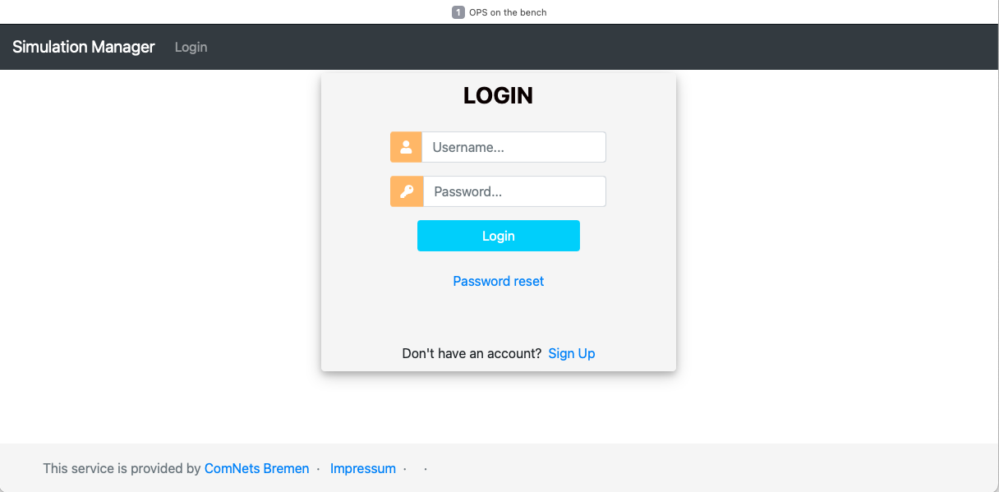
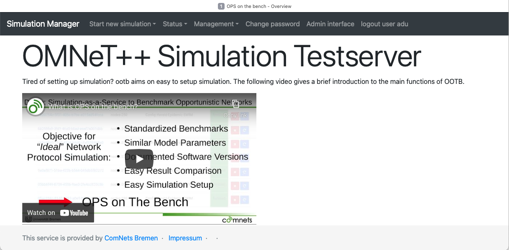

# Running Simulation

Simulations using the OOTB platform are invoked though a user's web browser. The link is as follows.

```bash
http://192.168.1.5:8000
```

A few operations of OOTB and their screenshots are shows below.

To use OOTB, a user must login to the system. Every user must create and confirm the e-mail address before hand to get the logging credentials. The picture below shows the login screen.

<p align="center">

</p>

Once user has logged in, the following screen appears which has a set of pull-down menus.

<p align="center">

</p>

The `Start new simulation` pull-down provides three options.

- Run a simulation by giving an `omnetpp.ini` file
- Run a simulation by creating a configuration using a wizard
- Run a benchmark simulation

<p align="center">

</p>

Rest of the functions and their details will be made available in subsequent updates.
