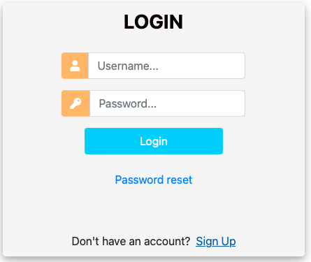
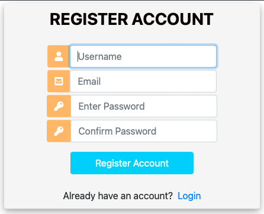

# User Manual

OPS-on-the-Bench (OOTB) is a modeling and simulation as a service platform to simulate opportunistic 
networks. The details below describe using the system once installed. Information such as the architecture, installing and starting the system are available in other documents of this repository (e.g., [Building and Installing](res/INSTALL.md), [Bringing Up](res/START.md)). The sections of this documents are ordered in the following manner.

- Creating an account and login to system - [Account Creation](#account-creation-and-login)
- Running simulations - [Simulate](#simulate-opportunistic-networks)
- Simulating networks - [Simulate Opportunistic Networks](#simulate-opportunistic-networks)
- Check statrus of simulations and manage - [Simulation Status Check and Management](#simulation-status-check-and-management)
- Collect and download meta information - [Simulation Meta Information Management](#simulation-meta-information-management)
- Manage own user account - [User Management](#user-management)
- Administer system - [System Administration](#system-administration)
- Logout of system - [Logout](#logout)
- Using the advanced features of the system - [Enabling Advanced Features](#enabling-advanced-features)

## Account Creation and Login
To use the OOTB system, a user must have a valid account to login. Details of account creation and login are given in this section.

#### Login to system

The first scrteen shown when using the system is the login dialog seen below.

If you have an account, use the `Username` and the `Password` to login to the system. If not, click on `Sign Up` to
create an account. If you have fogotten your password, click on the `Password reset` to assign a new password.

#### Creating an account

The account creation is done by filling the `REGISTER ACCOUNT` dialog seen below.

All fields are compulsory. Once completed, click the `Register Account` to create your account. If there are a 
errors, they will be shown immediately. If the account creation was successful, an email is sent to the email
address given. This email has a link to click to confirm the account creation before a login.  

If the email is not received, two usual reasons are,

- email address was incorrect
- email was received but moved to another folder in the email client (such as the Junk folder)

If non of these, then contact the system administrator using `ootb at comnets.uni-bremen.de`.

## Simulate Opportunistic Networks

## Simulation Status Check and Management

## Simulation Meta Information Management

## User Management

## System Administration

## Logout

## Enabling Advanced Features

